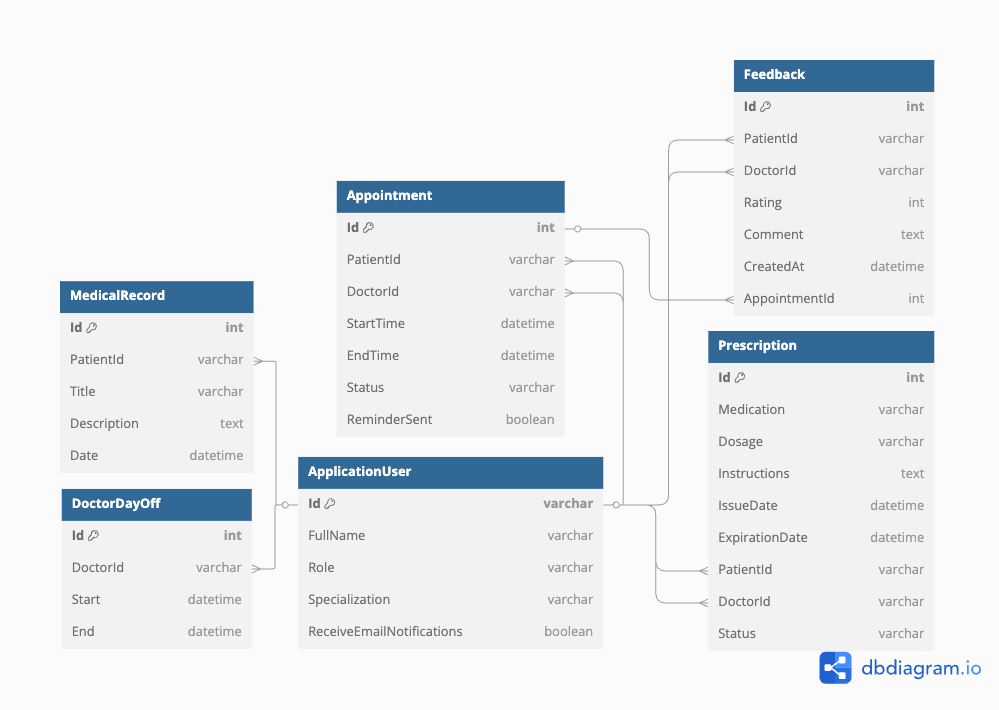

# MedLife Hospital Project Report

## 1. Project Overview

The MedLife Hospital Appointment System functions as an innovative web application which simplifies hospital management steps to boost efficiency across all hospital staff. ASP.NET Core Razor Pages and Entity Framework Core and SQLite alongside integrated AI analytics allow MedLife to create an application which offers robust security features and impressive scalability and delivers an excellent user experience. Beyond original specifications the system implements elaborate AI analytics together with advanced user participation features.

## 2. Functional Requirements

### 2.1 User Roles and Authentication

The MedLife platform delivers its core functions to serve Patients together with Doctors as well as Administrators. Every process from registration to appointment booking and record tracking and feedback submission becomes easy for patients to perform. The healthcare professionals can execute their schedule administration while keeping medical records maintained and receiving AI-based diagnostic support. Hospital administrators exercise full control over user accounts, appointments and internal messages to achieve operational efficiency throughout the facility.

### 2.2 User Management

Microsoft Identity supports an advanced user-friendly registration together with secure authentication based on roles. The system enables administrators to handle doctor profiles with ease while managing appointments and designating specializations for better role administration and operational improvement.

### 2.3 Appointment Booking and Management

The medical practice arranges their appointments in thirty-minute slots between 9 AM and 5 PM with the exception of scheduled breaks and individual physician absence days. The medical facility enforces strict policies for rescheduling (48 hours notice) and cancellation regulation (24 hours notice) which leads to decreased operational complications. Doctors smoothly handle their timeslots without any problems while administrators keep total system control to stop scheduling problems.

### 2.4 Notifications and Reminders

Programmed email procedures minimize patient nonattendance through early appointment confirmation procedures and reminder messages that support shared .ics calendar (Google and Outlook) files. The system provides administrators with manual notification functionality for specific patient communication needs and debugging support and gives patients full control to manage their notification preferences.

### 2.5 Search and Filtering

Through user-friendly search features patients swiftly find appropriate doctors either by area of specialization or medical personnel name. Internal appointment management becomes easy through both date and doctor and status filter functionalities which integrate perfectly with tables and calendars.

## 3. Database Design and Security

### 3.1 Database Schema

Critical data stored in MedLife’s database uses secure well-structured tables to house information in Users, Appointments, Feedback, DoctorDaysOff, Prescriptions and MedicalRecords. Through planned indexing (hashing + binary searching) the schema establishes both high-quality data management and peak system query efficiency.

The full database schema is available here: [View the ER Diagram](https://dbdiagram.io/d/HospitalDB-67f00ccb4f7afba18464ef89).

### 3.2 Security Measures

Identity protection systems based on roles successfully secure secret information. The application benefits from both parameterized queries through Entity Framework Core and robust password encryption built into ASP.NET Identity to safeguard data adequately.

## 4. Project Evaluation

### 4.1 Functionality

The healthcare platform MedLife provides users with top-notch authentication and simple appointment scheduling coupled with advanced booking features and notification technology combined with complex search functionality.

### 4.2 Database Design and Implementation

The database achieves excellent performance and reliability along with high speed through optimized SQL queries and strategic indexing and clear data relationships and stringent validation.

### 4.3 Code Quality and Security

Clear maintenance practices alongside excellent organizational structure and security standards make future development and growth of the project simple. The project benefits from documentation tools located in both Documentation.chtml and README files.

### 4.4 Documentation and Presentation

Through detailed inline documentation and testing procedures and presentation clarity the system becomes easier to maintain. The user-friendly interface enables a novice user to understand the environment without any difficulties.

## 5. Optimizations and Improvements

The system performance has been improved through advanced optimization of indexing together with dynamic AJAX implementations and improved scheduling algorithms and high-speed caching technology and optimized delivery of emails. Medical analysis speed and accuracy have risen dramatically because AI integration received precise optimization for its diagnostic functions.

## 6. User Experience Highlights

The patient booking process operates efficiently and exposes them to feedback channels and safe access to their full medical documentation. Secure AI solutions that host locally assist doctors to create more efficient schedules while streamlining approval processes alongside providing AI insights for patient care excellence.

## 7. Technical Implementation

The MedLife system incorporates extensive technical components such as ASP.NET Core Razor Pages, Entity Framework Core and SQLite together with Microsoft Identity, SMTP email services, AJAX, JavaScript, and FullCalendar.js and local AI implementation through Ollama Qwen2.5. The system implements MVC principles with Bootstrap and customized CSS to create responsive interfaces that please users.

## 8. Security and Compliance

Security measures defined by roles provide organizations with complete data protection as well as compliance with regulatory requirements. Sanctioned encryption methods and safe procedures for data management successfully maintain patient privacy integrity.

## 9. Performance and Scalability

The efficient database management of MedLife enables users to have smooth interactions regardless of anticipated growth or rising customer numbers.

## 10. Future Enhancements

The upcoming updates of the system will add telehealth features along with complex analytics tools and SMS alert systems to improve user satisfaction.

## 11. Challenges and Solutions

Critical project challenges effectively resolved include appointment scheduling conflicts addressed via advanced Entity Framework Core implementations, dynamic filtering solutions using AJAX and FullCalendar.js, responsive HTML email compatibility, and sophisticated AI integration through meticulously engineered custom prompts.

## 12. Conclusion

The MedLife Hospital Appointment System uses innovative practical technology to improve operational efficiency while enhancing patient care quality alongside data security protection which establishes itself as an essential management tool in modern hospitals.

## 13. Screenshots
### 13.1 Home Page

### 13.2 Appointment Booking

### 13.2 Appointment Calendar

### 13.3 Appointment Management

### 13.3 Appointment Confirmation Doctor Accepted

### 13.4 Appointment Confirmation Patient Email .ics

### 13.5 Feedback Submission After Appointment

### 13.6 Different Status of Appointments

### 13.7 Doctor Profile > Feedback

### 13.8 Doctor Profile > Medical Records with AI chat

### 13.9 Prescriptions

### 13.10 Doctor Days Off

### 13.11 Administrator > Roles Management

### 13.12 Privacy Policy

### 13.13 Login Page

### 13.14 Registration Page

### 13.15 Documentation Page

And more to discover in the project! Feel free to explore the code and the features implemented in the project or simply run the application to see it in action ;)

## 14. Contact Information
For any questions or inquiries, please feel free to contact me at: louis.alex.esnault@gmail.com